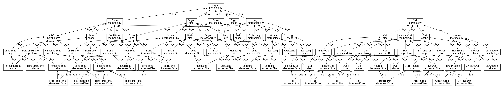

A sample multi-axial ontology. Source includes recipe for creating a
lattice (EQ) from two (tree) ontologies E and Q.

```
Each node in EQ has two direct parents, one from E inference, one from
Q inference (both trivial). Any node in EQ has N paths parents where
the parents are the cross-product of {i in LinearPath(E)} x {j in
LinearPath(Q)}. The number of paths of a node in EQ is |Ancestors(E)|
x |Ancestors(Q)|
```

The primary purpose of this repo is to explore visualization of
lattices by deconstructing the lattice back into trees, or something
approaching trees.

The idea is that when browsing EQ, you could choose to see one of two
axes: anatomical vs qualitative

In reality this will be messier and recursive. The anatomical ontology
will not be a tree but a lattice itself made from trees. For real
ontologies, the ultimate primatives are rarely true trees.

Two possible approaches:

 1. At time of reasoning annotate inferred superclass axioms with axis of classification
 2. Make browser reasoner-aware

1 is probably easiest and most robust to incomplete
axiomatization. See the Makefile for how this is done using owltools.
See also issue https://github.com/cmungall/multi-axial-ontology-test/issues/1
And comments further down

## Dumb Lattice

This shows what the entire ontology looks like using standard graphviz paradigm

Lattice with dumb repetitive information:



## Multiple Paths

A standard technique is to show a hierarchical view starting at a
focus node, ie denormalized tree view. This becomes rapidly worse as
latticeyness increases.


```
 / http://example.org/test/Organ-morphology ! Organ morphology
  is_a http://example.org/test/Bone-morphology ! Bone morphology
   is_a http://example.org/test/Bone-size ! Bone size
    is_a http://example.org/test/Bone-decreasedSize ! Bone decreasedSize
     is_a http://example.org/test/LimbBone-decreasedSize ! LimbBone decreasedSize
      is_a http://example.org/test/HindLimbBone-decreasedSize ! HindLimbBone decreasedSize *** 
    is_a http://example.org/test/LimbBone-size ! LimbBone size
     is_a http://example.org/test/HindLimbBone-size ! HindLimbBone size
      is_a http://example.org/test/HindLimbBone-decreasedSize ! HindLimbBone decreasedSize *** 
     is_a http://example.org/test/LimbBone-decreasedSize ! LimbBone decreasedSize
      is_a http://example.org/test/HindLimbBone-decreasedSize ! HindLimbBone decreasedSize *** 
   is_a http://example.org/test/LimbBone-morphology ! LimbBone morphology
    is_a http://example.org/test/HindLimbBone-morphology ! HindLimbBone morphology
     is_a http://example.org/test/HindLimbBone-size ! HindLimbBone size
      is_a http://example.org/test/HindLimbBone-decreasedSize ! HindLimbBone decreasedSize *** 
    is_a http://example.org/test/LimbBone-size ! LimbBone size
     is_a http://example.org/test/HindLimbBone-size ! HindLimbBone size
      is_a http://example.org/test/HindLimbBone-decreasedSize ! HindLimbBone decreasedSize *** 
     is_a http://example.org/test/LimbBone-decreasedSize ! LimbBone decreasedSize
      is_a http://example.org/test/HindLimbBone-decreasedSize ! HindLimbBone decreasedSize *** 
  is_a http://example.org/test/Organ-size ! Organ size
   is_a http://example.org/test/Bone-size ! Bone size
    is_a http://example.org/test/Bone-decreasedSize ! Bone decreasedSize
     is_a http://example.org/test/LimbBone-decreasedSize ! LimbBone decreasedSize
      is_a http://example.org/test/HindLimbBone-decreasedSize ! HindLimbBone decreasedSize *** 
    is_a http://example.org/test/LimbBone-size ! LimbBone size
     is_a http://example.org/test/HindLimbBone-size ! HindLimbBone size
      is_a http://example.org/test/HindLimbBone-decreasedSize ! HindLimbBone decreasedSize *** 
     is_a http://example.org/test/LimbBone-decreasedSize ! LimbBone decreasedSize
      is_a http://example.org/test/HindLimbBone-decreasedSize ! HindLimbBone decreasedSize *** 
   is_a http://example.org/test/Organ-decreasedSize ! Organ decreasedSize
    is_a http://example.org/test/Bone-decreasedSize ! Bone decreasedSize
     is_a http://example.org/test/LimbBone-decreasedSize ! LimbBone decreasedSize
      is_a http://example.org/test/HindLimbBone-decreasedSize ! HindLimbBone decreasedSize *** 
```


## Notes

This repo currently only has a single example, a cross-product of two trees

I may later rearrange into subdirs of increasing complexity

## Proposed UI Algorithm

### Pre-processing

Annotate each edge with information about what kind of classification
it is. E.g. "anatomical" vs "quality".

See the Makefile for examples of how to do this with owltools. See
eq-annotated.owl for an example.

Note in our fake example, it's relatively regular

    LargeBone SubClassOf LargeOrgan ## ANATOMICAL
    LargeBone SubClassOf BoneMorphology ## QUALITY

In practice it may not be regular. There may be nodes in the
cross-product missing. E.g.

    LargeBone SubClassOf OrganMorphology ## ANATOMICAL, QUALITY

In many cases there will be axiomatization lacking and the isa link
will have been asserted by a human, without any 'why'

In real cases we will also have a deep imports chain and explanations
for links may be non-local. 

### Rendering

(draft)

One approach would be simply to select an axis (eg ANATOMICAL) and
only show those links. This works for a regular lattice derived from
two strict trees. But not all ontologies will be regular this way.

Thus it would be better to allow selection of 'profiles'.

Other heuristics: if the path upwards cannot be continued using the
profile, then continue on ALL for one hop.

